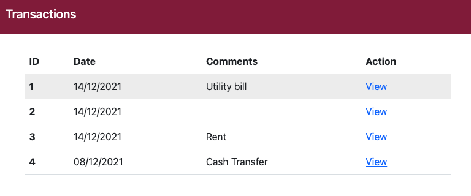
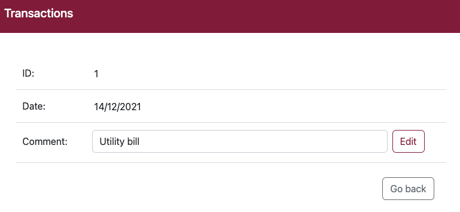

# Angular 


## Environment

- Angular 14
- Bootstrap
- SCSS

## Installing & Run

```shell
$ git clone https://github.com/hyewondev/angular-app.git

$ cd angular-app

$ npm install

$ ng serve --open
```

## Test
```shell
$ ng test
```

## Screens


